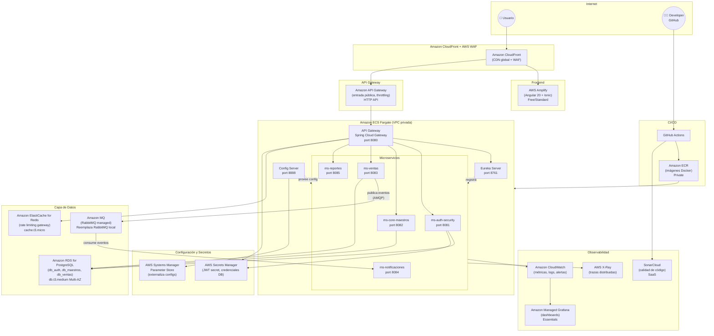

# Despliegue en AWS — Sistema Restaurant

## Arquitectura propuesta



---

## Mapeo de componentes

| Componente actual | Servicio AWS | Tier recomendado | Motivo |
|---|---|---|---|
| Angular 20 + Ionic (SPA) | **AWS Amplify** | Free / Standard | Hosting estático con CI/CD automático desde GitHub, CDN incluida |
| Spring Cloud Gateway | **AWS ECS Fargate** | On-demand | Corre el gateway como contenedor sin gestionar servidores |
| Eureka Server | **AWS ECS Fargate** | On-demand | Compatibilidad directa; AWS Cloud Map si se quiere migrar después |
| Config Server | **AWS ECS Fargate** + **AWS Systems Manager** | On-demand + Standard | Config Server como contenedor; Parameter Store como backend de propiedades |
| ms-auth-security | **AWS ECS Fargate** | On-demand | Microservicio sin estado, escala automática |
| ms-core-maestros | **AWS ECS Fargate** | On-demand | Microservicio sin estado |
| ms-ventas | **AWS ECS Fargate** | On-demand | Microservicio sin estado |
| ms-notificaciones | **AWS ECS Fargate** | On-demand | Consumer de eventos, escala con la cola |
| ms-reportes | **AWS ECS Fargate** | On-demand | Microservicio sin estado |
| PostgreSQL local | **Amazon RDS for PostgreSQL** | db.t3.medium Multi-AZ | Managed, backups automáticos, failover, 3 bases en 1 instancia |
| RabbitMQ | **Amazon MQ (RabbitMQ)** | mq.t3.micro | AMQP 0-9-1 compatible con Spring AMQP; cero cambios de código |
| Redis (rate limiting) | **Amazon ElastiCache for Redis** | cache.t3.micro | Managed Redis, integración directa con Spring Data Redis |
| Prometheus + Grafana | **Amazon CloudWatch** + **Amazon Managed Grafana** | Standard + Essentials | Nativo en AWS, sin infraestructura adicional |
| SonarQube | **SonarCloud** (SaaS) | Free / Developer | Integración nativa con GitHub Actions |
| Docker Registry local | **Amazon ECR** | Private | Almacén de imágenes Docker privado, integrado con ECS |
| Secretos (JWT, contraseñas) | **AWS Secrets Manager** | Standard | Gestión segura de secretos, rotación automática, integrado con ECS |
| CI/CD | **GitHub Actions** | Free | Ya usan GitHub; pipelines build → ECR → deploy ECS |
| Entrada pública / throttling | **Amazon API Gateway** | HTTP API | Rate limiting, throttling, autorizadores Lambda, CORS |
| CDN + HTTPS global | **Amazon CloudFront + AWS WAF** | Standard | CDN, SSL termination, WAF, routing SPA + API |
| Redes privadas | **Amazon VPC** | — | Aísla todos los servicios backend del acceso público directo |

---

## Diagrama de red y flujo de datos

```
Internet
   │
   ▼
Amazon CloudFront + AWS WAF  ──────────────────────▶  AWS Amplify
(CDN, WAF, SSL)                                        (Angular Frontend)
   │
   ▼
Amazon API Gateway (HTTP API)
(throttling, CORS, rutas /api/*)
   │
   ▼  (VPC privada — sin IP pública directa)
┌──────────────────────────────────────────────────────────┐
│              Amazon ECS Fargate Cluster                   │
│                    (VPC: 10.0.0.0/16)                    │
│                                                          │
│  ┌─────────────────┐    ┌──────────────────┐            │
│  │  API Gateway    │    │  Eureka Server   │            │
│  │  (Spring Cloud) │    │  (Service Disc.) │            │
│  └────────┬────────┘    └──────────────────┘            │
│           │                                              │
│  ┌────────┼───────────────────────────────────────┐     │
│  │        ▼                                        │     │
│  │  ┌──────────┐ ┌──────────┐ ┌──────────┐       │     │
│  │  │ms-auth   │ │ms-maes   │ │ms-ventas │       │     │
│  │  │(8081)    │ │(8082)    │ │(8083)    │       │     │
│  │  └──────────┘ └──────────┘ └────┬─────┘       │     │
│  │  ┌──────────┐ ┌──────────┐      │              │     │
│  │  │ms-noti   │ │ms-reportes│     │ publica      │     │
│  │  │(8084) ◀──┼─┼──────────┼─────┘ eventos      │     │
│  │  └──────────┘ └──────────┘                     │     │
│  └─────────────────────────────────────────────────┘     │
└──────────────────────────────────────────────────────────┘
         │              │              │
         ▼              ▼              ▼
  Amazon RDS        Amazon MQ      Amazon
  PostgreSQL        (RabbitMQ)     ElastiCache
  Multi-AZ          (AMQP 0-9-1)   for Redis
  ├── db_auth
  ├── db_maestros
  └── db_ventas
```

---

## Cambios de código necesarios

### 1. Sin cambios — Amazon MQ (RabbitMQ)

Amazon MQ ofrece RabbitMQ managed con el mismo protocolo AMQP 0-9-1. Solo cambia la connection string:

```yaml
# application.yml (ms-ventas, ms-notificaciones)
spring:
  rabbitmq:
    host: ${RABBITMQ_HOST}       # b-xxxxxxxx.mq.us-east-1.amazonaws.com
    port: 5671
    username: ${RABBITMQ_USERNAME}
    password: ${RABBITMQ_PASSWORD}
    ssl.enabled: true
```

> **Ventaja sobre Azure Service Bus**: cero cambios de código — mismo driver Spring AMQP, mismo protocolo AMQP 0-9-1.

### 2. Config Server → AWS Systems Manager Parameter Store

El Config Server puede seguir corriendo como contenedor Fargate sin tocar código. Si se quiere migrar nativamente a Parameter Store:

```xml
<!-- pom.xml -->
<dependency>
    <groupId>io.awspring.cloud</groupId>
    <artifactId>spring-cloud-aws-starter-parameter-store</artifactId>
    <version>3.1.0</version>
</dependency>
```

```yaml
# bootstrap.yml
spring:
  config:
    import: aws-parameterstore:/config/restaurant/
```

### 3. Secretos → AWS Secrets Manager

```xml
<!-- pom.xml -->
<dependency>
    <groupId>io.awspring.cloud</groupId>
    <artifactId>spring-cloud-aws-starter-secrets-manager</artifactId>
    <version>3.1.0</version>
</dependency>
```

```yaml
# bootstrap.yml
spring:
  config:
    import: aws-secretsmanager:restaurant/prod/secrets
```

Alternativa sin cambiar código — inyección directa desde la task definition de ECS:

```json
{
  "secrets": [
    {
      "name": "JWT_SECRET",
      "valueFrom": "arn:aws:secretsmanager:us-east-1:123456789:secret:restaurant/jwt-secret"
    },
    {
      "name": "DB_PASSWORD",
      "valueFrom": "arn:aws:secretsmanager:us-east-1:123456789:secret:restaurant/db-credentials:password::"
    }
  ]
}
```

### 4. Observabilidad → AWS X-Ray + CloudWatch

```xml
<!-- pom.xml -->
<dependency>
    <groupId>io.awspring.cloud</groupId>
    <artifactId>spring-cloud-aws-starter-xray</artifactId>
    <version>3.1.0</version>
</dependency>
```

```yaml
# application.yml
cloud:
  aws:
    xray:
      enabled: true
    region:
      static: us-east-1
```

Habilitar CloudWatch Container Insights en el cluster ECS para métricas de CPU, memoria y red por servicio.

---

## Pipeline CI/CD — GitHub Actions

```yaml
# .github/workflows/deploy-aws.yml

name: Build & Deploy to AWS

on:
  push:
    branches: [main]

env:
  AWS_REGION: us-east-1
  ECR_REGISTRY: ${{ secrets.AWS_ACCOUNT_ID }}.dkr.ecr.us-east-1.amazonaws.com

jobs:
  build-and-push:
    runs-on: ubuntu-latest
    steps:
      - uses: actions/checkout@v4

      - name: Configure AWS credentials
        uses: aws-actions/configure-aws-credentials@v4
        with:
          aws-access-key-id: ${{ secrets.AWS_ACCESS_KEY_ID }}
          aws-secret-access-key: ${{ secrets.AWS_SECRET_ACCESS_KEY }}
          aws-region: ${{ env.AWS_REGION }}

      - name: Login to Amazon ECR
        uses: aws-actions/amazon-ecr-login@v2

      - name: Build & push images
        run: |
          docker build -t $ECR_REGISTRY/api-gateway:$GITHUB_SHA \
            ./Backend/restaurant-backend/api-gateway
          docker push $ECR_REGISTRY/api-gateway:$GITHUB_SHA
          # ... repetir por servicio

  deploy:
    needs: build-and-push
    runs-on: ubuntu-latest
    steps:
      - name: Configure AWS credentials
        uses: aws-actions/configure-aws-credentials@v4
        with:
          aws-access-key-id: ${{ secrets.AWS_ACCESS_KEY_ID }}
          aws-secret-access-key: ${{ secrets.AWS_SECRET_ACCESS_KEY }}
          aws-region: ${{ env.AWS_REGION }}

      - name: Update ECS task definition with new image
        id: task-def
        uses: aws-actions/amazon-ecs-render-task-definition@v1
        with:
          task-definition: .aws/task-def-api-gateway.json
          container-name: api-gateway
          image: ${{ env.ECR_REGISTRY }}/api-gateway:${{ github.sha }}

      - name: Deploy to ECS Fargate
        uses: aws-actions/amazon-ecs-deploy-task-definition@v1
        with:
          task-definition: ${{ steps.task-def.outputs.task-definition }}
          service: api-gateway-service
          cluster: restaurant-cluster
          wait-for-service-stability: true

  sonar:
    runs-on: ubuntu-latest
    steps:
      - uses: actions/checkout@v4
      - name: SonarCloud Scan
        uses: SonarSource/sonarcloud-github-action@master
        env:
          SONAR_TOKEN: ${{ secrets.SONAR_TOKEN }}
```

---

## Estimación de costos (zona us-east-1)

| Servicio | Tier | Costo aproximado/mes |
|---|---|---|
| AWS Amplify | Free / Standard | $0–5 |
| Amazon ECS Fargate (9 servicios, ~5M req/mes) | On-demand | ~$40–90 |
| Amazon RDS PostgreSQL | db.t3.medium Multi-AZ | ~$65 |
| Amazon MQ (RabbitMQ) | mq.t3.micro Single | ~$18 |
| Amazon ElastiCache for Redis | cache.t3.micro | ~$14 |
| Amazon CloudWatch (5 GB logs/mes) | Pay-as-you-go | ~$8 |
| Amazon Managed Grafana | Essentials | ~$9 |
| Amazon ECR | Private (10 GB) | ~$1 |
| AWS Secrets Manager | Standard (10 secretos) | ~$4 |
| AWS Systems Manager Parameter Store | Standard | ~$1 |
| Amazon API Gateway | HTTP API (1M calls) | ~$1 |
| Amazon CloudFront + AWS WAF | Standard | ~$20–35 |
| NAT Gateway | — | ~$32 |
| SonarCloud | Free (OSS) / Developer | $0 / $10 |
| **TOTAL estimado** | | **~$213–273/mes** |

> Para dev/staging se puede reducir a ~$80/mes usando instancias más pequeñas, Single-AZ en RDS, y apagando el NAT Gateway fuera de horario laboral.

---

## Recursos a crear en AWS (orden de creación)

```
1.  IAM Roles:              ecsTaskExecutionRole (ECR + Secrets Manager + SSM + X-Ray)
                            ecsTaskRole (CloudWatch Logs, X-Ray)

2.  VPC:                    vpc-restaurant (10.0.0.0/16)
                              Subnets privadas:  10.0.1.0/24, 10.0.2.0/24 (us-east-1a/b)
                              Subnets públicas:  10.0.101.0/24, 10.0.102.0/24
                              Internet Gateway, NAT Gateway

3.  Security Groups:        sg-alb          (80, 443 desde 0.0.0.0/0)
                            sg-ecs-tasks    (8080-8085 desde sg-alb)
                            sg-rds          (5432 desde sg-ecs-tasks)
                            sg-redis        (6379 desde sg-ecs-tasks)
                            sg-mq           (5671 desde sg-ecs-tasks)

4.  AWS Secrets Manager:    restaurant/prod/jwt-secret
                            restaurant/prod/db-credentials
                            restaurant/prod/rabbitmq-credentials

5.  Amazon ECR:             restaurant/api-gateway
                            restaurant/eureka-server
                            restaurant/config-server
                            restaurant/ms-auth-security
                            restaurant/ms-core-maestros
                            restaurant/ms-ventas
                            restaurant/ms-notificaciones
                            restaurant/ms-reportes

6.  Amazon RDS PostgreSQL:  psql-restaurant-prod (db.t3.medium, Multi-AZ)
                              Databases: db_auth, db_maestros, db_ventas

7.  Amazon ElastiCache:     redis-restaurant-prod (cache.t3.micro, 1 nodo)

8.  Amazon MQ (RabbitMQ):   mq-restaurant-prod (mq.t3.micro, Single-Instance)
                              Virtual host: restaurant_vh
                              Queues: pedidos, notificaciones

9.  SSM Parameter Store:    /config/restaurant/eureka/uri
                            /config/restaurant/db/url
                            /config/restaurant/ ... (configs de microservicios)

10. Application Load Balancer: alb-restaurant-internal (interno, subnets privadas)
                                Listeners: puerto 80 → target groups por servicio

11. ECS Cluster:            restaurant-cluster (Fargate + Container Insights ON)

12. ECS Task Definitions:   Una por servicio:
                              api-gateway, eureka-server, config-server,
                              ms-auth, ms-maestros, ms-ventas,
                              ms-notificaciones, ms-reportes

13. ECS Services:           Una por task definition
                              Auto-scaling: min 1, max 5 por servicio
                              Health check grace period: 60s

14. Amazon API Gateway:     apigw-restaurant-prod (HTTP API)
                              Integración: VPC Link → ALB interno
                              Rutas: ANY /api/{proxy+}

15. Amazon CloudFront:      cf-restaurant-prod
                              Origin 1: AWS Amplify (/*.html, /assets/*)
                              Origin 2: API Gateway (/api/*)
                              AWS WAF asociado: waf-restaurant

16. AWS Amplify:            amplify-restaurant-frontend
                              Conectado a rama main de GitHub
                              Build: ng build --configuration production

17. Amazon Managed Grafana: grafana-restaurant-prod
                              Datasource: Amazon CloudWatch
                              Dashboards: ECS, RDS, MQ, Redis, API Gateway

18. CloudWatch Alarms:      CPU > 80% por servicio ECS
                            RDS connections > 80%
                            MQ queue depth > 1000
                            API Gateway 5xx > 1%
```

---

## Diferencias clave vs Azure

| Aspecto | Azure | AWS |
|---|---|---|
| Contenedores serverless | Azure Container Apps | AWS ECS Fargate |
| Message Broker | Azure Service Bus (AMQP 1.0) | **Amazon MQ RabbitMQ (AMQP 0-9-1)** — cero cambios de código |
| API pública | Azure API Management | Amazon API Gateway (HTTP API) |
| CDN + WAF | Azure Front Door | Amazon CloudFront + AWS WAF |
| Frontend hosting | Azure Static Web Apps | AWS Amplify |
| Secretos | Azure Key Vault | AWS Secrets Manager |
| Config externa | Azure App Configuration | AWS Systems Manager Parameter Store |
| Trazas distribuidas | Application Insights | AWS X-Ray |
| Logs y métricas | Azure Monitor | Amazon CloudWatch |
| Registry de imágenes | Azure Container Registry | Amazon ECR |
| Costo estimado/mes | ~$180–230 | ~$213–273 |

> La diferencia de costo se explica principalmente por el NAT Gateway de AWS (~$32/mes) y el costo de Amazon MQ vs Azure Service Bus en tier Consumption.

---

## Preguntas frecuentes

**¿Por qué ECS Fargate y no EKS?**
ECS Fargate es serverless sobre contenedores — sin gestionar planos de control, nodos ni upgrades. Para esta escala de proyecto es suficiente y más barato. EKS se justifica cuando se necesita control total (custom CNI, operators, node pools dedicados) — misma lógica que preferir Container Apps sobre AKS en Azure.

**¿Por qué Amazon MQ y no SQS/SNS?**
Amazon MQ corre RabbitMQ managed con protocolo AMQP 0-9-1 nativo. Spring AMQP funciona sin ningún cambio de código — solo cambia el hostname. SQS requeriría reemplazar el cliente RabbitMQ por el SDK de AWS. Amazon MQ es el drop-in replacement más directo.

**¿Por qué mantener Eureka y no usar AWS Cloud Map?**
Para no tocar código. AWS Cloud Map tiene DNS interno propio, pero requeriría reemplazar todas las referencias a Eureka en los microservicios. La recomendación es mantener Eureka en Fargate y migrar en una segunda fase si el equipo lo decide.

**¿CloudFront + API Gateway o solo uno de los dos?**
CloudFront enruta al Amplify (Angular) y al API Gateway (APIs REST). API Gateway hace el rate limiting y conecta al ALB interno vía VPC Link. Se puede simplificar usando solo CloudFront con Lambda@Edge para auth si no se necesita gestión avanzada de APIs.

**¿VPC Link es necesario?**
Sí. Amazon API Gateway HTTP API no puede apuntar directamente a un ALB privado sin un VPC Link. Es el equivalente al peering de redes en Azure. Tiene un costo fijo de ~$7/mes adicional no incluido en la tabla (absorbido en el ítem de API Gateway).
