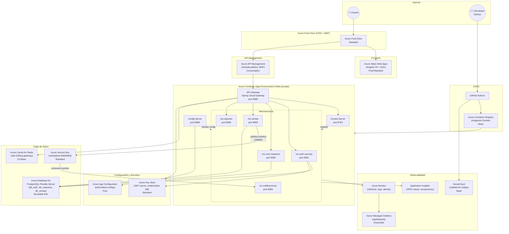

# Despliegue en Azure — Sistema Restaurant

## Arquitectura propuesta



---

## Mapeo de componentes

| Componente actual | Servicio Azure | Tier recomendado | Motivo |
|---|---|---|---|
| Angular 20 + Ionic (SPA) | **Azure Static Web Apps** | Free / Standard | Hosting estático con CDN global y deploy automático desde GitHub |
| Spring Cloud Gateway | **Azure Container Apps** | Consumption | Corre el gateway como contenedor dentro del environment privado |
| Eureka Server | **Azure Container Apps** | Consumption | Compatibilidad directa; Container Apps tiene DNS interno propio si se quiere migrar después |
| Config Server | **Azure Container Apps** + **Azure App Configuration** | Consumption + Free | Config Server como contenedor; App Configuration como backend de propiedades |
| ms-auth-security | **Azure Container Apps** | Consumption | Microservicio sin estado, escala a cero |
| ms-core-maestros | **Azure Container Apps** | Consumption | Microservicio sin estado |
| ms-ventas | **Azure Container Apps** | Consumption | Microservicio sin estado |
| ms-notificaciones | **Azure Container Apps** | Consumption | Consumer de eventos, ideal para escalar con cola |
| ms-reportes | **Azure Container Apps** | Consumption | Microservicio sin estado |
| PostgreSQL local | **Azure Database for PostgreSQL Flexible Server** | Burstable B2s | Managed, backups automáticos, 3 bases de datos en 1 instancia |
| RabbitMQ | **Azure Service Bus** | Standard | AMQP 1.0 compatible con Spring AMQP; sin mantenimiento de broker |
| Redis (rate limiting) | **Azure Cache for Redis** | C0 Basic | Managed Redis, integración directa con Spring Data Redis |
| Prometheus + Grafana | **Azure Monitor** + **Azure Managed Grafana** | Standard + Essentials | Nativo en Azure, sin infraestructura adicional |
| SonarQube | **SonarCloud** (SaaS) | Free / Developer | Integración nativa con GitHub Actions |
| Docker Registry local | **Azure Container Registry** | Basic | Almacén de imágenes Docker privado |
| Secretos (JWT, contraseñas) | **Azure Key Vault** | Standard | Gestión segura de secretos, integrado con Container Apps |
| CI/CD | **GitHub Actions** | Free | Ya usan GitHub; pipelines build → ACR → deploy ACA |
| Entrada pública / WAF | **Azure API Management** | Consumption | Rate limiting, WAF, throttling, versioning de APIs |
| CDN + HTTPS global | **Azure Front Door** | Standard | CDN, SSL termination, routing SPA + API |
| Redes privadas | **Azure Virtual Network** | — | Aísla todos los servicios backend del acceso público directo |

---

## Diagrama de red y flujo de datos

```
Internet
   │
   ▼
Azure Front Door  ──────────────────────────────▶  Azure Static Web Apps
(CDN, WAF, SSL)                                      (Angular Frontend)
   │
   ▼
Azure API Management
(throttling, auth, swagger docs)
   │
   ▼  (VNet privada — sin IP pública)
┌──────────────────────────────────────────────────────────┐
│              Azure Container Apps Environment             │
│                                                          │
│  ┌─────────────────┐    ┌──────────────────┐            │
│  │  API Gateway    │    │  Eureka Server   │            │
│  │  (Spring Cloud) │    │  (Service Disc.) │            │
│  └────────┬────────┘    └──────────────────┘            │
│           │                                              │
│  ┌────────┼───────────────────────────────────────┐     │
│  │        ▼                                        │     │
│  │  ┌──────────┐ ┌──────────┐ ┌──────────┐       │     │
│  │  │ms-auth   │ │ms-maes   │ │ms-ventas │       │     │
│  │  │(8081)    │ │(8082)    │ │(8083)    │       │     │
│  │  └──────────┘ └──────────┘ └────┬─────┘       │     │
│  │  ┌──────────┐ ┌──────────┐      │              │     │
│  │  │ms-noti   │ │ms-reportes│     │ publica      │     │
│  │  │(8084) ◀──┼─┼──────────┼─────┘ eventos      │     │
│  │  └──────────┘ └──────────┘                     │     │
│  └─────────────────────────────────────────────────┘     │
└──────────────────────────────────────────────────────────┘
         │              │              │
         ▼              ▼              ▼
  Azure Database    Azure Service   Azure Cache
  PostgreSQL         Bus             for Redis
  Flexible Server   (AMQP)          (rate limit)
  ├── db_auth
  ├── db_maestros
  └── db_ventas
```

---

## Cambios de código necesarios

### 1. RabbitMQ → Azure Service Bus

Spring AMQP es compatible con AMQP 1.0. Agregar dependencia y cambiar connection string:

```xml
<!-- pom.xml (ms-ventas, ms-notificaciones) -->
<dependency>
    <groupId>com.azure</groupId>
    <artifactId>azure-servicebus</artifactId>
    <version>7.15.0</version>
</dependency>
```

```yaml
# application.yml
spring:
  rabbitmq:
    host: ${SERVICE_BUS_HOSTNAME}
    port: 5671
    username: ${SERVICE_BUS_POLICY_NAME}
    password: ${SERVICE_BUS_POLICY_KEY}
    ssl.enabled: true
```

### 2. Config Server → Azure App Configuration

El Config Server puede seguir corriendo como contenedor. Si se quiere migrar, agregar:

```xml
<dependency>
    <groupId>com.azure.spring</groupId>
    <artifactId>spring-cloud-azure-appconfiguration-config</artifactId>
</dependency>
```

### 3. Secretos → Azure Key Vault

```xml
<dependency>
    <groupId>com.azure.spring</groupId>
    <artifactId>spring-cloud-azure-starter-keyvault-secrets</artifactId>
</dependency>
```

```yaml
spring:
  cloud:
    azure:
      keyvault:
        secret:
          endpoint: https://<vault-name>.vault.azure.net/
```

### 4. Observabilidad → Application Insights

```xml
<dependency>
    <groupId>com.microsoft.azure</groupId>
    <artifactId>applicationinsights-spring-boot-starter</artifactId>
    <version>3.5.4</version>
</dependency>
```

```yaml
applicationinsights:
  connection-string: ${APPLICATIONINSIGHTS_CONNECTION_STRING}
```

---

## Pipeline CI/CD — GitHub Actions

```yaml
# .github/workflows/deploy.yml (esquema simplificado)

name: Build & Deploy to Azure

on:
  push:
    branches: [main]

jobs:
  build-and-push:
    runs-on: ubuntu-latest
    steps:
      - uses: actions/checkout@v4
      - name: Login to ACR
        uses: azure/docker-login@v1
        with:
          login-server: ${{ secrets.ACR_SERVER }}
          username: ${{ secrets.ACR_USERNAME }}
          password: ${{ secrets.ACR_PASSWORD }}
      - name: Build & push images
        run: |
          docker build -t $ACR/api-gateway:$GITHUB_SHA ./api-gateway
          docker push $ACR/api-gateway:$GITHUB_SHA
          # ... repetir por servicio

  deploy:
    needs: build-and-push
    runs-on: ubuntu-latest
    steps:
      - name: Deploy to Azure Container Apps
        uses: azure/container-apps-deploy-action@v1
        with:
          resource-group: rg-restaurant
          container-app-name: api-gateway
          image: ${{ secrets.ACR_SERVER }}/api-gateway:${{ github.sha }}

  sonar:
    runs-on: ubuntu-latest
    steps:
      - uses: actions/checkout@v4
      - name: SonarCloud Scan
        uses: SonarSource/sonarcloud-github-action@master
        env:
          SONAR_TOKEN: ${{ secrets.SONAR_TOKEN }}
```

---

## Estimación de costos (zona East US)

| Servicio | Tier | Costo aproximado/mes |
|---|---|---|
| Azure Static Web Apps | Free | $0 |
| Azure Container Apps (8 apps, ~5M req/mes) | Consumption | ~$30–80 |
| Azure Database for PostgreSQL Flexible | Burstable B2s (2 vCore, 8 GB) | ~$60 |
| Azure Service Bus | Standard (1M ops) | ~$10 |
| Azure Cache for Redis | C0 Basic (250 MB) | ~$16 |
| Azure Monitor + Log Analytics | Pay-as-you-go (5 GB/mes) | ~$10 |
| Azure Managed Grafana | Essentials | ~$9 |
| Azure Container Registry | Basic | ~$5 |
| Azure Key Vault | Standard (10k ops) | ~$1 |
| Azure App Configuration | Free | $0 |
| Azure API Management | Consumption (1M calls) | ~$3.50 |
| Azure Front Door | Standard | ~$35 |
| SonarCloud | Free (OSS) / Developer | $0 / $10 |
| **TOTAL estimado** | | **~$180–230/mes** |

> Para dev/staging se puede reducir a ~$80/mes usando tiers Free/Basic y escalando a cero los Container Apps.

---

## Recursos a crear en Azure (orden de creación)

```
1. Resource Group:          rg-restaurant-prod
2. Virtual Network:         vnet-restaurant (10.0.0.0/16)
3. Key Vault:               kv-restaurant-prod
4. Container Registry:      acrrestaurant (Premium para geo-replication)
5. PostgreSQL Flexible:      psql-restaurant-prod  (3 databases)
6. Azure Cache for Redis:    redis-restaurant-prod
7. Service Bus Namespace:    sb-restaurant-prod  (queues: pedidos, notificaciones)
8. App Configuration:        appconf-restaurant-prod
9. Application Insights:     ai-restaurant-prod
10. Log Analytics Workspace: law-restaurant-prod
11. Managed Grafana:         grafana-restaurant-prod
12. Container Apps Env:      cae-restaurant-prod  (en VNet privada)
13. Container Apps (x9):     api-gateway, eureka, config-server,
                              ms-auth, ms-maestros, ms-ventas,
                              ms-notificaciones, ms-reportes, (futuro)
14. API Management:          apim-restaurant-prod
15. Static Web Apps:         swa-restaurant-frontend
16. Front Door:              fd-restaurant-prod
```

---

## Preguntas frecuentes

**¿Por qué Container Apps y no AKS?**
Container Apps es serverless sobre Kubernetes — sin gestionar planos de control, nodos, ni upgrades. Para esta escala de proyecto es suficiente y más barato. AKS solo se justifica si se necesita control total (custom CNI, operators, node pools dedicados).

**¿Por qué mantener Eureka y no usar el DNS nativo de Container Apps?**
Para no tocar código. Container Apps tiene DNS interno propio (`<app>.internal`), pero requeriría reemplazar las referencias a Eureka en todos los servicios. Migrar en una segunda fase.

**¿RabbitMQ o Azure Service Bus?**
Azure Service Bus es AMQP 1.0 compatible. Spring AMQP funciona con un cambio de connection string. Evita gestionar el broker, ofrece 99.9% SLA, dead-letter automático y mensajes de hasta 256 KB en Standard.

**¿Por qué Front Door y APIM juntos?**
Front Door actúa como CDN global y enruta al Static Web App (Angular) y a APIM. APIM hace el rate limiting, gestión de APIs, y proxy hacia el gateway interno. Se pueden combinar o usar solo APIM si no se necesita CDN global.
